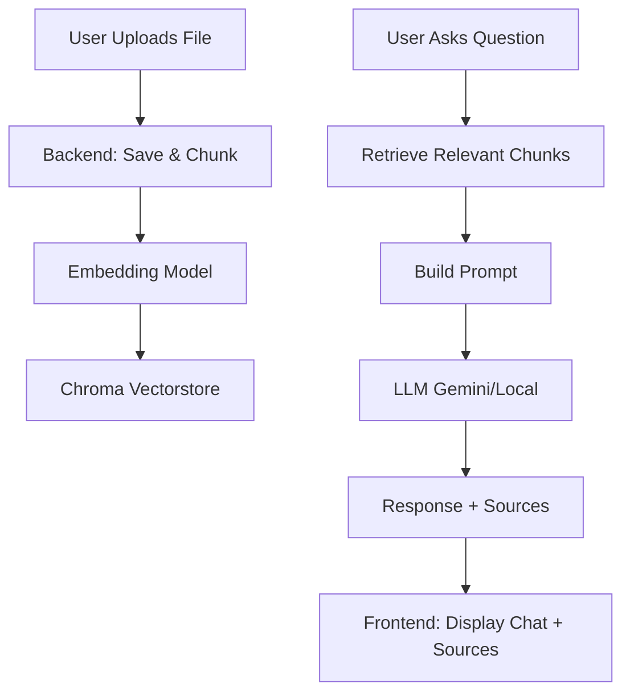

# RAG Chatbot

A modern web-based chatbot using Retrieval-Augmented Generation (RAG) architecture with support for multiple LLM providers.

## Features

- 🤖 **RAG Architecture**: Retrieval-Augmented Generation for context-aware responses
- 📄 **Multi-format Support**: Upload and process PDF, DOCX, and TXT files
- 🧠 **Multiple LLM Providers**: 
  - Google Gemini (Cloud)
  - Local models via LM Studio (phi-2, Gemma, etc.)
- 🎨 **Modern UI**: Clean, responsive interface with dark mode support, beautiful chat bubbles, avatars, typing status, and real-time progress
- 📊 **Vector Storage**: Chroma vector store for efficient document retrieval
- 🔍 **Document Management**: Upload, view, and manage your knowledge base
- 🛠️ **Admin Dashboard**: View/delete vectorstore, manage uploads, view chunk details
- 🧩 **API Explorer**: Interactive API docs and testing
- 🌏 **Vietnamese default answers**: Optimized for Vietnamese context
- 📝 **Prompt logging, source deduplication, multi-chunk synthesis**

## Project Structure

```
RAG_ChatBot_01/
├── main.py                 # Flask application entry point, all routes
├── requirements.txt        # Python dependencies
├── env.example            # Environment variables template
├── config.py               # App configuration
├── backend/
│   ├── __init__.py
│   ├── llm_provider.py    # LLM provider management (Gemini, Local, ...)
│   ├── document_loader.py # Document processing, chunking, file parsing
│   └── vector_store.py    # Vector store operations (ChromaDB)
├── templates/
│   ├── index.html         # Main chat UI
│   ├── admin.html         # Admin dashboard (view/delete DB, chunk details)
│   ├── api_docs.html      # API Explorer (Swagger-like)
│   └── test_upload.html   # (Optional) Test upload UI
├── static/
│   ├── style.css          # All CSS (modern, responsive, dark mode)
│   └── main.js            # All JS (chat, upload, progress, admin, ...)
├── data/
│   ├── uploads/           # Uploaded files
│   ├── vectorstore/       # Chroma vector store (persisted DB)
│   └── sample/            # Sample documents for testing
│       ├── ai_technologies.txt
│       └── sample_document.txt
├── logoBSR.png            # Company logo (used in sidebar, AI avatar)
└── README.md
```

## UI/UX Highlights
- **Modern chat bubbles**: Wide, readable, responsive, source files shown below each answer
- **Progress bar**: Shows both upload and chunking progress, with cancel/continue on page close
- **Sidebar**: LLM/model selection, DB/model status, document/chunk count, clear all
- **Admin dashboard**: View/delete vectorstore, see all chunks, chunk details, delete by document
- **API Explorer**: Live API docs and testing
- **Dark mode**: Toggle with one click
- **Company logo**: Sidebar and AI avatar
- **Vietnamese default answers**: Optimized for Vietnamese context

### UI Screenshots (add your own images in docs/)

```markdown


```

---

## How it works (Pipeline)

### Pipeline Diagram (Mermaid)



---

### 1. Upload & Process Documents
- User uploads PDF, DOCX, or TXT files via the web UI.
- Backend saves files to `data/uploads/`.
- Each file is parsed and split into text chunks (configurable chunk size/overlap).

### 2. Embedding & Vectorstore
- Each chunk is embedded using a model (e.g. `intfloat/multilingual-e5-large`).
- Embeddings + metadata (file name, position, ...) are stored in ChromaDB (`data/vectorstore/`).

### 3. Chat & Retrieval
- User sends a question via chat UI.
- Backend retrieves top relevant chunks (semantic search) from vectorstore.
- Special keyword chunks are auto-merged for context.
- Last 10 chat turns are included for context.
- Prompt is constructed (context + history + question) and sent to LLM (Gemini or Local).
- LLM response is returned, formatted, and sources are deduplicated.

### 4. Frontend Display & Management
- Modern chat UI: chat bubbles, avatars, typing status, Enter to send, Shift+Enter for newline.
- Upload progress bar (with chunking progress), cancel/continue on page close.
- Sidebar: LLM/model selection, document/chunk count, DB/model status, clear all button.
- Admin dashboard: view/delete vectorstore, see all chunks, chunk details, delete by document.
- API Explorer: interactive docs and live API testing.

### 5. API & Admin
- `/api-docs`: API Explorer (auto-generated docs, live test)
- `/admin`: Admin dashboard (view/delete DB, chunk details)
- Main APIs: upload, chat, documents, vectorstore status, clear vectorstore, delete document, chat history, ...

### 6. Session & History
- Chat history is stored in Flask session (cookie-based, per user).
- Last 10 turns are used for context in prompt.
- History is cleared on refresh or new session.

## Sample Data
- Sample files in `data/sample/` for quick testing.
- You can upload these to see how the system works.

## Installation & Usage

1. **Clone the repository**
   ```bash
   git clone <repository-url>
   cd RAG_ChatBot_01
   ```
2. **Create virtual environment**
   ```bash
   python -m venv venv
   source venv/bin/activate  # On Windows: venv\Scripts\activate
   ```
3. **Install dependencies**
   ```bash
   pip install -r requirements.txt
   ```
4. **Set up environment variables**
   ```bash
   cp env.example .env
   # Edit .env with your API keys and configuration
   ```
5. **Start the application**
   ```bash
   python main.py
   ```
6. **Open your browser**
   - Go to `http://localhost:5000`

## Configuration

- All config via `.env` or `config.py` (see `env.example` for all options)
- Key options:
  - `GOOGLE_API_KEY`: Gemini API key
  - `LOCAL_LLM_ENDPOINT`: LM Studio endpoint
  - `VECTOR_STORE_PATH`: Path to ChromaDB
  - `UPLOAD_FOLDER`: Where uploads are stored
  - `MAX_FILE_SIZE`: Max upload size (default 50MB)

## API Endpoints (Main)
- `GET /` - Main chat UI
- `POST /upload` - Upload and process documents (returns doc_id, triggers chunking)
- `GET /processing-status?doc_id=...` - Get chunking progress
- `POST /chat` - Chat with RAG bot
- `GET /documents` - List uploaded documents
- `POST /clear-vectorstore` - Delete all vectorstore data
- `GET /vectorstore-status` - Get DB/model status, doc/chunk count
- `GET /history` - Get chat history
- `POST /clear-history` - Clear chat history

## Development & Customization
- Add new LLM: Extend `backend/llm_provider.py`
- Add new document type: Extend `backend/document_loader.py`
- Change chunking/embedding: Edit `config.py` or `document_loader.py`
- UI/UX: Edit `templates/index.html`, `static/style.css`, `static/main.js`
- Admin/API: Edit `templates/admin.html`, `templates/api_docs.html`

## Troubleshooting
- **Upload lỗi 413**: Tăng `MAX_CONTENT_LENGTH` trong Flask và proxy (Nginx/Apache)
- **Không nhận model local**: Kiểm tra LM Studio đã chạy và endpoint đúng
- **Gemini lỗi 404/401**: Kiểm tra API key và quota
- **Vectorstore lỗi**: Xóa thư mục `data/vectorstore/` để reset

## License
MIT License

## Acknowledgments
- [LangChain](https://langchain.com/) for RAG framework
- [Chroma](https://www.trychroma.com/) for vector storage
- [LM Studio](https://lmstudio.ai/) for local LLM hosting
- [Google Gemini](https://ai.google.dev/) for cloud LLM access

## Cách hoạt động của web app

### 1. Upload và xử lý tài liệu
- Người dùng upload file PDF, DOCX, TXT qua giao diện web.
- Backend lưu file vào thư mục `data/uploads/`.
- File được đọc và chia nhỏ thành các chunk (theo cấu hình chunk_size, chunk_overlap).

### 2. Sinh embedding và lưu vectorstore
- Mỗi chunk được chuyển thành vector embedding bằng model (ví dụ: `intfloat/multilingual-e5-large`).
- Các embedding và metadata (tên file, vị trí, loại file, ...) được lưu vào vector database (ChromaDB) trong `data/vectorstore/`.

### 3. Truy vấn và sinh câu trả lời
- Khi người dùng gửi câu hỏi:
  1. Backend lấy 12 chunk liên quan nhất (theo embedding) từ vectorstore.
  2. Tự động tìm thêm các chunk chứa từ khóa đặc biệt trong câu hỏi (ví dụ: "208HV", "NMLD") để ghép vào context.
  3. Lấy 10 lượt hội thoại gần nhất từ session để truyền vào prompt.
  4. Ghép context (có cắt chunk tối đa 2000 ký tự), lịch sử hội thoại, và câu hỏi thành prompt.
  5. Gửi prompt này lên LLM (Gemini hoặc local LLM qua LM Studio).
  6. Nhận câu trả lời, format HTML đẹp.
  7. Trả về frontend cùng danh sách nguồn (file) duy nhất.

### 4. Hiển thị và quản lý trên frontend
- Giao diện chat hiện đại, hỗ trợ:
  - Gửi tin nhắn bằng Enter, xuống dòng bằng Shift+Enter.
  - Chọn LLM, model Gemini động.
  - Upload tài liệu, xem danh sách tài liệu đã upload.
  - Hiển thị lịch sử hội thoại, nguồn tài liệu liên quan.
- Trang admin:
  - Xem toàn bộ chunk trong vectorstore, click để xem chi tiết nội dung và metadata.
  - Xóa toàn bộ vectorstore hoặc từng tài liệu.
  - Xem API docs, thử API trực tiếp.

### 5. API và quản trị
- Có trang API Explorer (`/api-docs`) tự động liệt kê và cho phép thử các endpoint.
- Các API chính: upload, chat, lấy danh sách tài liệu, debug vectorstore, xóa vectorstore, xóa tài liệu, lấy lịch sử chat, ...

### 6. Lịch sử hội thoại và session
- Lịch sử hội thoại được lưu trong session Flask (cookie).
- Khi refresh hoặc đổi session, lịch sử sẽ bị xóa.
- Khi gửi câu hỏi, 10 lượt hội thoại gần nhất sẽ được truyền vào prompt để giữ ngữ cảnh.

### 7. Tối ưu và bảo trì
- Có thể đổi model embedding, chunk_size, chunk_overlap trong code/config.
- Có thể xem/log prompt gửi lên LLM để debug.
- Có thể mở rộng thêm các chức năng quản trị, tìm kiếm, phân quyền, ...